# Wordpress-
Codepath week 7-8
## CVE-2015-3440: Stored XSS in a comment
### Sources:https://klikki.fi/adv/wordpress2.html, https://www.exploit-db.com/exploits/36844

### Overview:
  Many of the wordpress version before 4.2.1 were vulnerable to stored cross-site -scripting attacks. Attackers can inject Javascript in a comment in a post and the attack would commence once the administrator has approved of a previous comment.
  The comment itself would need to be a very long comment(64kb or more) because that is the limit the MySQL database allows. 
  Once the code has been triggered, the attacker can act as the administrator and change the password, add a new post, etc.
  
### Walkthrough:
  
    First, the attacker would need to post a harmless comment so that the adminstrator could approve the comment.
    After the administrator approves a single comment from a user(the attacker in this case), the user will no longer need approval for any of the further comments. 
    I had problems with this step because i wasn able to view posts at first. I kept getting a 404 error.
 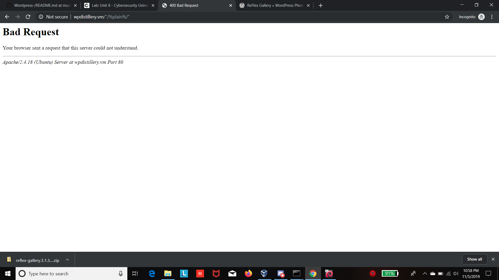
    I had to change the permalink settings from "Custom Structure" to "Default"
 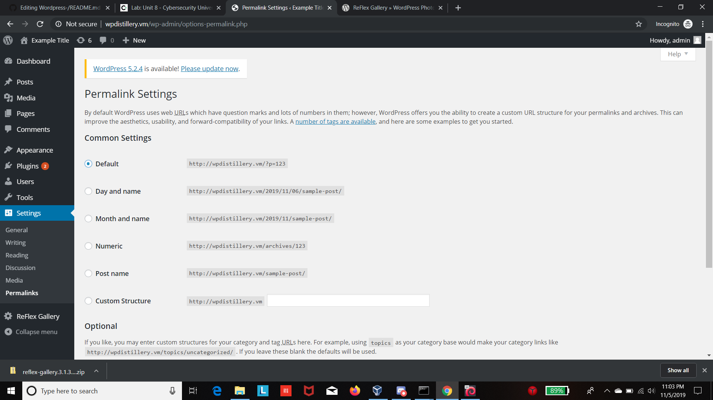
    After the first comment is approved, the attacker can then post a comment(which is the script in this case).
    The script would need to be 64kb long.
 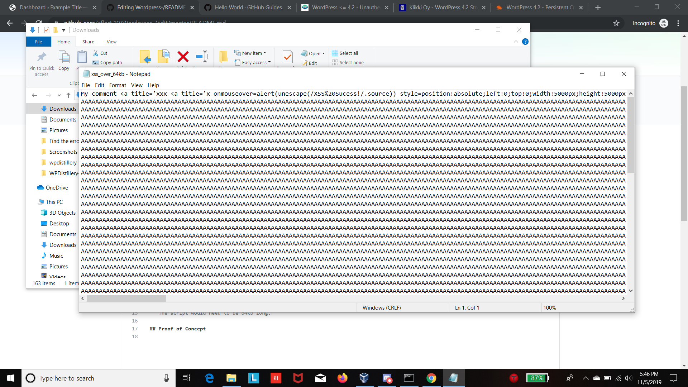
 
    
 ## Attack Confirmation
    After the comment with the script is posted, you can see the the alert box that shows you the script worked.
 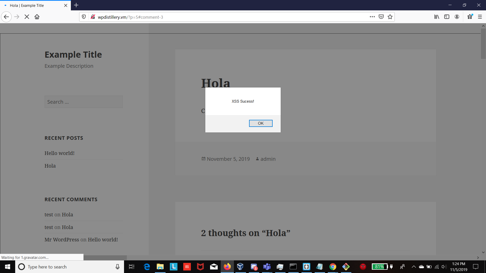

## CVE-2016-7168 Authenticated Stored Cross-Site Scripting via Image Filename
### Sources:https://sumofpwn.nl/advisory/2016/persistent_cross_site_scripting_vulnerability_in_wordpress_due_to_unsafe_processing_of_file_names.html

### Overview:

    Using this persistant cross site scrpting attack, an attacker can manipulate an admin(via social engineering) to upload an image with a filename(which includes the javascript in the name itself). When uploaded into wordpress, will allow the attacker to steal the admins session cookies and login info to act as the admin and manipulate the site.
    
### Walkthrough:
    -For this attack to work, the attacker would firsneed to perform some social engineering on the admin, so that the admin would upload the malicious image.
    -This is the name with the malicious javascript(highlighted text) of the file i used.
 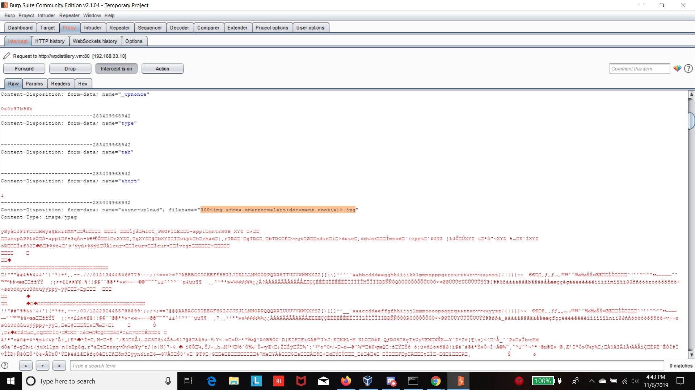
    
    -Once the attacker has persuaded the admin into uploading the malicioius image, You can see that the image will make it so the prompt will always appear when you enter the page.
    
### Attack Confirmation
 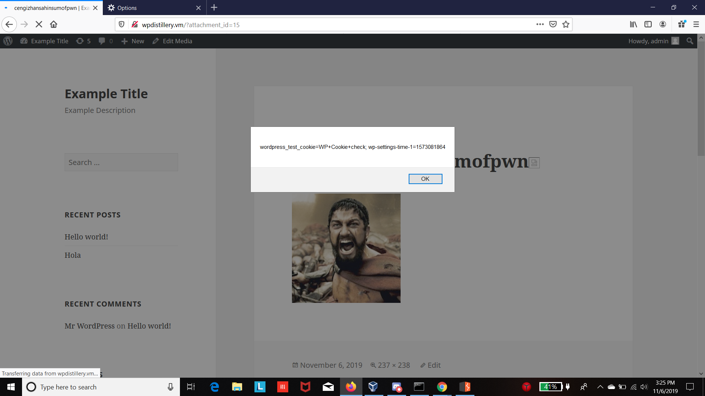
 
 

## CVE-2015-4133
### Sources: https://courses.codepath.com/courses/cybersecurity_university/unit/8#!exercises, https://www.rapid7.com/db/modules/exploit/unix/webapp/wp_reflexgallery_file_upload

## Overview:

   -This attack takes advantage of an arbitrary PHP code upload in the Wordpress plug-in Reflex-Gallery version 3.1.3.
   -When this plug-in is installed, an attacker can tske advantage of that bug and execute a remote shell and gain access to the database.
   
## Wlakthrough:

   First, you need to make sure that you have Reflex-Gallery installed and activated in Wordpress.
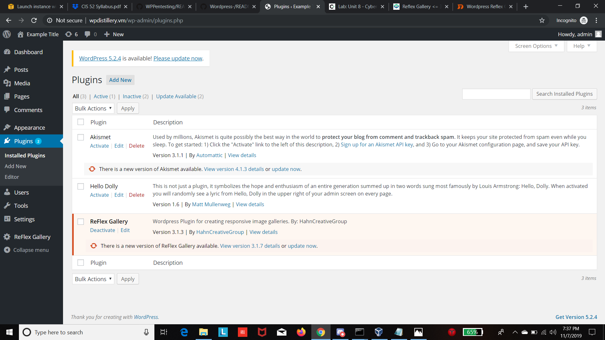

   After you make sure that REflex-Galery is installed, Your going to have to open up a metasploit terminal and search for the exploit using "msf> search Reflex"
   As you can see, metasploit will give you the script you are going to use for the exploit.
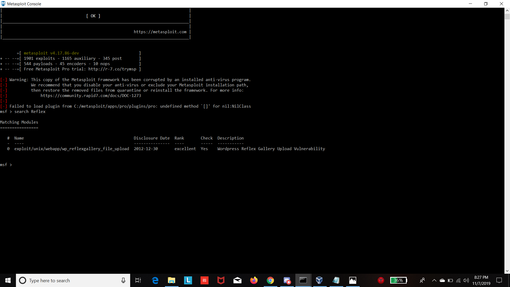

   Afterwards, you will set the target to wordpress site by using "msf> set RHOST target_website_link" For me, it was "wpdistillery.vm" and then you will execute the attack using the command "exploit"
   You can see the meterpeter session uploading then deleting the payload to open up the meterpeter session(our shell)
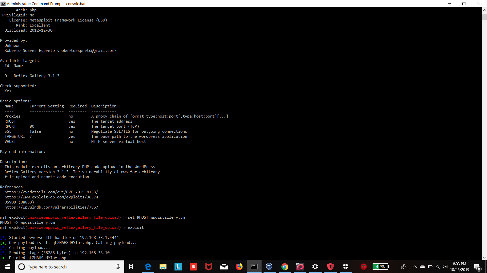

   When the meterpeter session has started, that means we have made a shell and now have access to the database
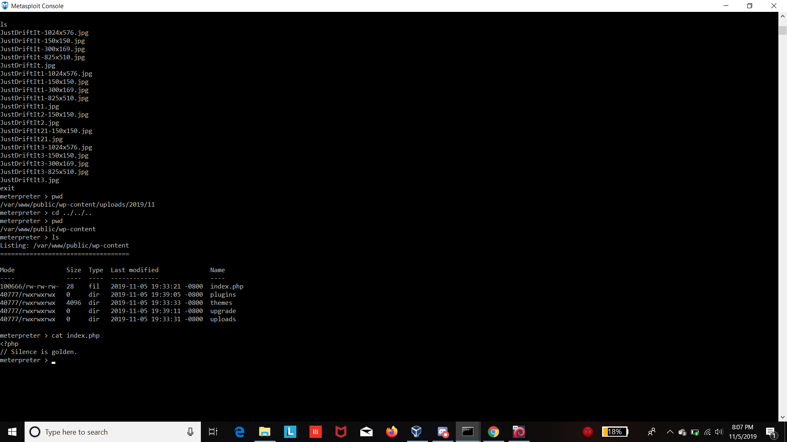
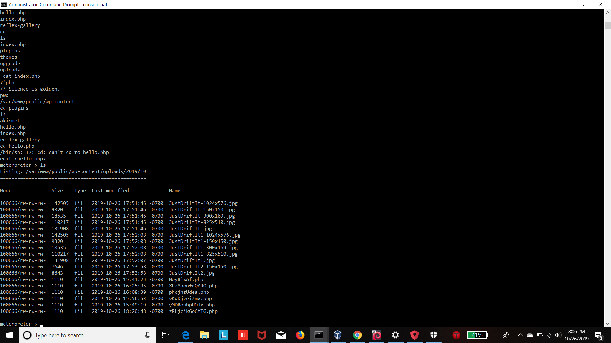

   After i got access to the database I was able to make a new file called file.txt, and edited it saying "you got hacked"
   
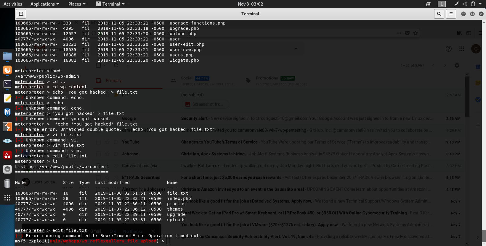
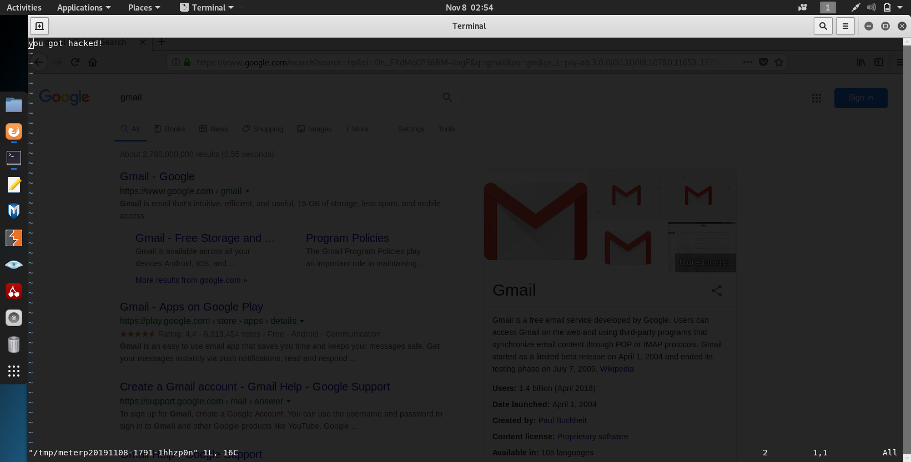

## Attack Succes
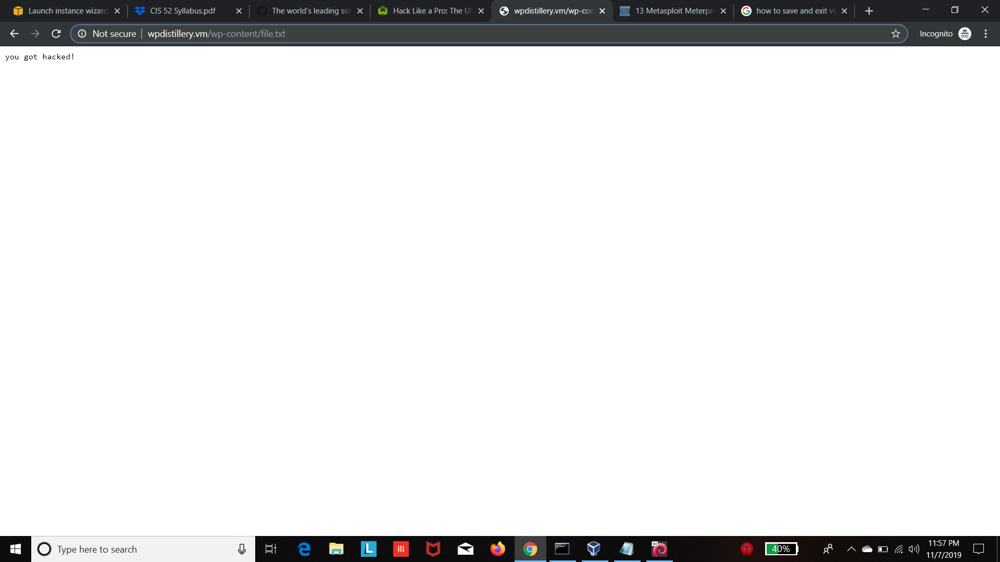
